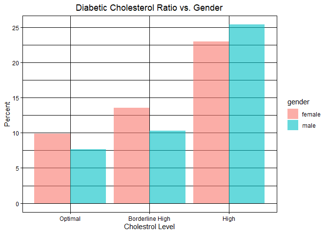

# Load library

```r
library(tidyverse)
```

```
## ── Attaching packages ─────────────────────────────────────── tidyverse 1.3.2 ──
## ✔ ggplot2 3.4.0      ✔ purrr   1.0.0 
## ✔ tibble  3.1.8      ✔ dplyr   1.0.10
## ✔ tidyr   1.2.1      ✔ stringr 1.5.0 
## ✔ readr   2.1.3      ✔ forcats 0.5.2 
## ── Conflicts ────────────────────────────────────────── tidyverse_conflicts() ──
## ✖ dplyr::filter() masks stats::filter()
## ✖ dplyr::lag()    masks stats::lag()
```

```r
library(RColorBrewer)
library(paletteer)
library(janitor)
```

```
## 
## Attaching package: 'janitor'
## 
## The following objects are masked from 'package:stats':
## 
##     chisq.test, fisher.test
```

```r
library(here)
```

```
## here() starts at C:/Users/USER/OneDrive/桌面/Group_project
```

```r
library(naniar)
library(shiny)
library(shinydashboard)
```

```
## 
## Attaching package: 'shinydashboard'
## 
## The following object is masked from 'package:graphics':
## 
##     box
```

# Get working directory

```r
getwd()
```

```
## [1] "C:/Users/USER/OneDrive/桌面/Group_project/Kellie Liu"
```
## Import and clean dataset

```r
diabetes <- read_csv("Group Project Data/diabetes.csv")
```

```
## Rows: 390 Columns: 16
## ── Column specification ────────────────────────────────────────────────────────
## Delimiter: ","
## chr  (3): gender, waist_hip_ratio, diabetes
## dbl (11): patient_number, cholesterol, glucose, hdl_chol, age, height, weigh...
## num  (2): chol_hdl_ratio, bmi
## 
## ℹ Use `spec()` to retrieve the full column specification for this data.
## ℹ Specify the column types or set `show_col_types = FALSE` to quiet this message.
```

Originally taken from Kaggle,
This dataset is originally from the National Institute of Diabetes and Digestive and Kidney Diseases 

## Take a looks at columns names to make sure they are all tidy

```r
names(diabetes)
```

```
##  [1] "patient_number"  "cholesterol"     "glucose"         "hdl_chol"       
##  [5] "chol_hdl_ratio"  "age"             "gender"          "height"         
##  [9] "weight"          "bmi"             "systolic_bp"     "diastolic_bp"   
## [13] "waist"           "hip"             "waist_hip_ratio" "diabetes"
```

## Find NAs

```r
anyNA(diabetes)
```

```
## [1] FALSE
```
## Check if any value is missing

```r
naniar::miss_var_summary(diabetes)
```

```
## # A tibble: 16 × 3
##    variable        n_miss pct_miss
##    <chr>            <int>    <dbl>
##  1 patient_number       0        0
##  2 cholesterol          0        0
##  3 glucose              0        0
##  4 hdl_chol             0        0
##  5 chol_hdl_ratio       0        0
##  6 age                  0        0
##  7 gender               0        0
##  8 height               0        0
##  9 weight               0        0
## 10 bmi                  0        0
## 11 systolic_bp          0        0
## 12 diastolic_bp         0        0
## 13 waist                0        0
## 14 hip                  0        0
## 15 waist_hip_ratio      0        0
## 16 diabetes             0        0
```

## Replace "," with "." for later calculation

```r
diabetes <- diabetes %>% 
  mutate_if(is.character, ~str_replace(., ",", ".")) %>%
  mutate(chol_ratio = as.numeric(cholesterol/hdl_chol))
diabetes
```

```
## # A tibble: 390 × 17
##    patient_nu…¹ chole…² glucose hdl_c…³ chol_…⁴   age gender height weight   bmi
##           <dbl>   <dbl>   <dbl>   <dbl>   <dbl> <dbl> <chr>   <dbl>  <dbl> <dbl>
##  1            1     193      77      49      39    19 female     61    119   225
##  2            2     146      79      41      36    19 female     60    135   264
##  3            3     217      75      54       4    20 female     67    187   293
##  4            4     226      97      70      32    20 female     64    114   196
##  5            5     164      91      67      24    20 female     70    141   202
##  6            6     170      69      64      27    20 female     64    161   276
##  7            7     149      77      49       3    20 female     62    115    21
##  8            8     164      71      63      26    20 male       72    145   197
##  9            9     230     112      64      36    20 male       67    159   249
## 10           10     179     105      60       3    20 female     58    170   355
## # … with 380 more rows, 7 more variables: systolic_bp <dbl>,
## #   diastolic_bp <dbl>, waist <dbl>, hip <dbl>, waist_hip_ratio <chr>,
## #   diabetes <chr>, chol_ratio <dbl>, and abbreviated variable names
## #   ¹​patient_number, ²​cholesterol, ³​hdl_chol, ⁴​chol_hdl_ratio
```

## Age vs. Diabetes

```r
diabetes %>% 
  mutate(diabetic=ifelse(diabetes == "Diabetes", 1, 0)) %>% 
  mutate(age_category=case_when(age<=19~"teenager",
         age>=20 & age<40~"adult",
         age>=40 & age<60~"mid aged",
         age>=60 & age<80~"senior",
         age>=80~"super senior")) %>%  
  filter(age_category!="NA") %>%  
  filter(diabetic != "NA") %>% 
  count(diabetic, age_category) %>% 
  pivot_wider(names_from = diabetic,
              names_prefix = "diabetic_",
              values_from = n) %>% 
  mutate(diabetic_per = diabetic_1*100/(diabetic_1+diabetic_0)) %>% 
  ggplot(aes(x=age_category, y=diabetic_per, fill=age_category))+
  geom_col(alpha=0.6, position="dodge")+
  theme_linedraw()+
  labs(title="Diabetes Age Range",
       x="Age Group",
       y="Percent")+
  scale_x_discrete(limits=c("teenager", "adult", "mid aged", "senior", "super senior"))+
  theme(plot.title = element_text(hjust = 0.5))
```

```
## Warning: Removed 1 rows containing missing values (`geom_col()`).
```

<!-- -->

## Age vs. Diabetes including Gender

```r
diabetes %>% 
  mutate(diabetic=ifelse(diabetes == "Diabetes", 1, 0)) %>% 
  mutate(age_category=case_when(age<=19~"teenager",
         age>=20 & age<40~"adult",
         age>=40 & age<60~"mid aged",
         age>=60 & age<80~"senior",
         age>=80~"super senior")) %>%  
  filter(age_category!="NA") %>%  
  filter(diabetic != "NA") %>% 
  count(diabetic, age_category, gender) %>% 
  pivot_wider(names_from = diabetic,
              names_prefix = "diabetic_",
              values_from = n) %>% 
  mutate(diabetic_per = diabetic_1*100/(diabetic_1+diabetic_0)) %>% 
  ggplot(aes(x=age_category, y=diabetic_per, fill=gender))+
  geom_col(alpha=0.6, position="dodge")+
  theme_linedraw()+
  labs(title="Diabetes Age Range vs. Gender",
       x="Age Group",
       y="Percent")+
  scale_x_discrete(limits=c("teenager", "adult", "mid aged", "senior", "super senior"))+
  theme(plot.title = element_text(hjust = 0.5))
```

```
## Warning: Removed 2 rows containing missing values (`geom_col()`).
```

<!-- -->

## Set new dataframe

```r
age_diabetes <- diabetes %>%
  mutate(diabetic=ifelse(diabetes == "Diabetes", 1, 0)) %>% 
  mutate(age_category=case_when(age<=19~"teenager",
         age>=20 & age<40~"adult",
         age>=40 & age<60~"mid aged",
         age>=60 & age<80~"senior",
         age>=80~"super senior")) %>%  
  filter(age_category!="NA")
age_diabetes
```

```
## # A tibble: 390 × 19
##    patient_nu…¹ chole…² glucose hdl_c…³ chol_…⁴   age gender height weight   bmi
##           <dbl>   <dbl>   <dbl>   <dbl>   <dbl> <dbl> <chr>   <dbl>  <dbl> <dbl>
##  1            1     193      77      49      39    19 female     61    119   225
##  2            2     146      79      41      36    19 female     60    135   264
##  3            3     217      75      54       4    20 female     67    187   293
##  4            4     226      97      70      32    20 female     64    114   196
##  5            5     164      91      67      24    20 female     70    141   202
##  6            6     170      69      64      27    20 female     64    161   276
##  7            7     149      77      49       3    20 female     62    115    21
##  8            8     164      71      63      26    20 male       72    145   197
##  9            9     230     112      64      36    20 male       67    159   249
## 10           10     179     105      60       3    20 female     58    170   355
## # … with 380 more rows, 9 more variables: systolic_bp <dbl>,
## #   diastolic_bp <dbl>, waist <dbl>, hip <dbl>, waist_hip_ratio <chr>,
## #   diabetes <chr>, chol_ratio <dbl>, diabetic <dbl>, age_category <chr>, and
## #   abbreviated variable names ¹​patient_number, ²​cholesterol, ³​hdl_chol,
## #   ⁴​chol_hdl_ratio
```

## Glucose vs. Diabetes

```r
age_diabetes %>%
  select(diabetes, glucose, age_category) %>% 
  group_by(diabetes, age_category) %>% 
  summarize(mean_glucose=mean(glucose)) %>% 
  ggplot(aes(x=diabetes, y=mean_glucose, fill=age_category))+
  geom_col(alpha=0.6, position="dodge")+
  theme_linedraw()+
  labs(title="Glucose Level",
       x="Diabetes",
       y="Glucose Level")+
  theme(plot.title = element_text(hjust = 0.5))
```

```
## `summarise()` has grouped output by 'diabetes'. You can override using the
## `.groups` argument.
```

<!-- -->

## Cholesterol vs. Diabetes

```r
diabetes %>% 
  mutate(diabetic=ifelse(diabetes == "Diabetes", 1, 0)) %>% 
  mutate(chol_category=case_when(chol_ratio<=3.5~"Optimal",
         chol_ratio>=3.5 & chol_ratio<5~"Borderline High",
         chol_ratio>=5~"High"))  %>%  
  filter(chol_category!="NA") %>%  
  filter(diabetic != "NA") %>% 
  count(diabetic, chol_category) %>% 
  pivot_wider(names_from = diabetic,
              names_prefix = "diabetic_",
              values_from = n) %>% 
  mutate(diabetic_per = diabetic_1*100/(diabetic_1+diabetic_0)) %>%
  ggplot(aes(x=chol_category, y=diabetic_per, fill = chol_category))+
  geom_col(alpha=0.6, position="dodge")+
  theme_linedraw()+
  labs(title="Cholesterol Ratio vs. Diabetic",
       x="Cholestrol Level",
       y="Percent")+
  scale_x_discrete(limits=c("Optimal", "Borderline High", "High"))+
  theme(plot.title = element_text(hjust = 0.5))
```

<!-- -->

## Cholesterol Ratio vs. Diabetes with Gender

```r
diabetes %>% 
  mutate(diabetic=ifelse(diabetes == "Diabetes", 1, 0)) %>% 
  mutate(chol_category=case_when(chol_ratio<=3.5~"Optimal",
         chol_ratio>=3.5 & chol_ratio<5~"Borderline High",
         chol_ratio>=5~"High"))  %>%  
  filter(chol_category!="NA") %>%  
  filter(diabetic != "NA") %>% 
  count(diabetic, chol_category, gender) %>% 
  pivot_wider(names_from = diabetic,
              names_prefix = "diabetic_",
              values_from = n) %>% 
  mutate(diabetic_per = diabetic_1*100/(diabetic_1+diabetic_0)) %>%
  ggplot(aes(x=chol_category, y=diabetic_per, fill = gender))+
  geom_col(alpha=0.6, position="dodge")+
  theme_linedraw()+
  labs(title="Diabetic Cholesterol Ratio vs. Gender",
       x="Cholestrol Level",
       y="Percent")+
  scale_x_discrete(limits=c("Optimal", "Borderline High", "High"))+
  theme(plot.title = element_text(hjust = 0.5))
```

<!-- -->

## Cholesterol Ratio vs. Gender

```r
diabetes %>% 
  mutate(diabetic=ifelse(diabetes == "Diabetes", 1, 0)) %>% 
  mutate(chol_category=case_when(chol_ratio<=3.5~"Optimal",
         chol_ratio>=3.5 & chol_ratio<5~"Borderline",
         chol_ratio>=5~"High"))  %>%  
  filter(chol_category!="NA") %>% 
  count(gender, chol_category) %>% 
  pivot_wider(names_from = chol_category,
              names_prefix = "chol_",
              values_from = n) %>% 
  mutate(Borderline = chol_Borderline*100/(chol_Borderline+chol_High+chol_Optimal),
         High= chol_High*100/(chol_Borderline+chol_High+chol_Optimal),
         Optimal = chol_Optimal*100/(chol_Borderline+chol_High+chol_Optimal)) %>%
  pivot_longer(-c(gender, chol_Borderline, chol_High, chol_Optimal),
               names_to = "chol_per_cat",
               values_to = "chol_per") %>% 
  ggplot(aes(x=chol_per_cat, y=chol_per, fill = gender))+
  geom_col(alpha=0.6, position="dodge")+
  theme_linedraw()+
  labs(title="Cholesterol Ratio vs. Gender",
       x="Cholestrol Level",
       y="Percent")+
  scale_x_discrete(limits=c("Optimal", "Borderline", "High"))+
  theme(plot.title = element_text(hjust = 0.5))
```

<!-- -->

## Gender vs. Diabetes

```r
diabetes %>% 
  mutate(diabetic=ifelse(diabetes == "Diabetes", 1, 0)) %>% 
  count(diabetic, gender) %>%
  pivot_wider(names_from = diabetic,
              names_prefix = "diabetic_",
              values_from = n) %>%
  mutate(diabetic_per = diabetic_1*100/(diabetic_1+diabetic_0)) %>% 
  ggplot(aes(x=gender, y=diabetic_per, fill = gender))+
  geom_col(alpha=0.6, position="dodge")+
  theme_linedraw()+
  labs(title="Gender vs. Diabetes",
       x="Gender",
       y="Percent")+
  theme(plot.title = element_text(hjust = 0.5))
```

<!-- -->

