# Library load

```r
library(tidyverse)
library(RColorBrewer)
library(paletteer)
library(janitor)
library(here)
library(naniar)
library(shiny)
library(shinydashboard)
```
# Get working directory

```r
getwd()
```

```
## [1] "/Users/manxiangling/Desktop/Group_project/Tony Tao"
```
# Import Data

```r
diabetes_2019 <- read_csv("Group Project Data/diabetes_dataset__2019.csv") %>% clean_names()
```

```
## Rows: 952 Columns: 18
## ── Column specification ────────────────────────────────────────────────────────
## Delimiter: ","
## chr (14): Age, Gender, Family_Diabetes, highBP, PhysicallyActive, Smoking, A...
## dbl  (4): BMI, Sleep, SoundSleep, Pregancies
## 
## ℹ Use `spec()` to retrieve the full column specification for this data.
## ℹ Specify the column types or set `show_col_types = FALSE` to quiet this message.
```
Originally taken from Kaggle,
This dataset was collected by Neha Prerna Tigga and Dr. Shruti Garg of the Department of Computer Science and Engineering, BIT Mesra, Ranchi-835215 
Tigga, N. P., & Garg, S. (2020). Prediction of Type 2 Diabetes using Machine Learning Classification Methods. Procedia Computer Science, 167, 706-716. DOI: https://doi.org/10.1016/j.procs.2020.03.336


```r
heart_failture <- read_csv("Group Project Data/heart_failure_clinical_records_dataset.csv") %>% clean_names()
```

```
## Rows: 299 Columns: 13
## ── Column specification ────────────────────────────────────────────────────────
## Delimiter: ","
## dbl (13): age, anaemia, creatinine_phosphokinase, diabetes, ejection_fractio...
## 
## ℹ Use `spec()` to retrieve the full column specification for this data.
## ℹ Specify the column types or set `show_col_types = FALSE` to quiet this message.
```
Originally taken from Kaggle,
Davide Chicco, Giuseppe Jurman: Machine learning can predict survival of patients with heart failure from serum creatinine and ejection fraction alone. BMC Medical Informatics and Decision Making 20, 16 (2020). https://doi.org/10.1186/s12911-020-1023-5

# Data overview
## Check for NA

```r
any_na(diabetes_2019)
```

```
## [1] TRUE
```


```r
any_na(heart_failture)
```

```
## [1] FALSE
```

## NA overveiw

```r
naniar::miss_var_summary(diabetes_2019)
```

```
## # A tibble: 18 × 3
##    variable          n_miss pct_miss
##    <chr>              <int>    <dbl>
##  1 pregancies            42    4.41 
##  2 bmi                    4    0.420
##  3 pdiabetes              1    0.105
##  4 diabetic               1    0.105
##  5 age                    0    0    
##  6 gender                 0    0    
##  7 family_diabetes        0    0    
##  8 high_bp                0    0    
##  9 physically_active      0    0    
## 10 smoking                0    0    
## 11 alcohol                0    0    
## 12 sleep                  0    0    
## 13 sound_sleep            0    0    
## 14 regular_medicine       0    0    
## 15 junk_food              0    0    
## 16 stress                 0    0    
## 17 bp_level               0    0    
## 18 uriation_freq          0    0
```


```r
naniar::miss_var_summary(heart_failture)
```

```
## # A tibble: 13 × 3
##    variable                 n_miss pct_miss
##    <chr>                     <int>    <dbl>
##  1 age                           0        0
##  2 anaemia                       0        0
##  3 creatinine_phosphokinase      0        0
##  4 diabetes                      0        0
##  5 ejection_fraction             0        0
##  6 high_blood_pressure           0        0
##  7 platelets                     0        0
##  8 serum_creatinine              0        0
##  9 serum_sodium                  0        0
## 10 sex                           0        0
## 11 smoking                       0        0
## 12 time                          0        0
## 13 death_event                   0        0
```


## Clean the data(2019):
make binary variables into numeric, countable variables. (Diabetes_2019)

```r
diabetes_2019_tidy <- diabetes_2019 %>% 
  mutate(high_bp_status = ifelse(high_bp == "yes", 1, 0)) %>% 
  mutate(family_heredity = ifelse(family_diabetes == "yes", 1, 0)) %>% 
  mutate(diabetic_status = ifelse(diabetic == "yes", 1, 0))
```

## Clean the data(heart failture):
make binary variables into numeric, countable variables. (heart_failture)

```r
heart_failture_tidy <- heart_failture %>% 
  mutate(smoking_status = ifelse(smoking == 1, "yes", "no")) %>% 
  mutate(high_bp_status = ifelse(high_blood_pressure == 1, "yes", "no"))
```


# Data analysis and plotting:

## High bp vs. diabetes

###For diabetes_2019:

```r
diabetes_2019_tidy %>% 
  filter(diabetic_status != "NA") %>% 
  count(diabetic_status, high_bp) %>% 
  pivot_wider(names_from = diabetic_status,
              names_prefix = "diabetic_",
              values_from = n) %>% 
  mutate(diabetic_per = diabetic_1/(diabetic_1+diabetic_0)) %>% 
  ggplot(aes(x=high_bp, y=diabetic_per, fill = high_bp, label=sprintf("%0.2f", round(diabetic_per, digits = 2))))+
  geom_col(alpha = 0.6)+
  scale_fill_discrete(labels=c("No", "Yes"))+
  geom_text(vjust = -0.3, color = "deepskyblue4")+
  theme_linedraw()+
  labs(title = "High bp vs. Diabetic", 
       x = NULL,
       y = "Diabetic Perentage")+
  guides(fill = guide_legend(title = "High bp"))+
  theme(plot.title = element_text(hjust = 0.5))
```

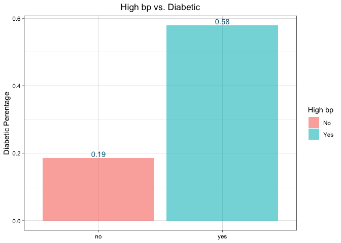<!-- -->
###For hear failture:

```r
heart_failture_tidy %>% 
  filter(diabetes != "NA") %>% 
  count(diabetes, high_bp_status) %>% 
  pivot_wider(names_from = diabetes,
              names_prefix = "diabetic_",
              values_from = n) %>% 
  mutate(diabetic_per = diabetic_1/(diabetic_1+diabetic_0)) %>% 
  ggplot(aes(x=high_bp_status, y=diabetic_per, fill = high_bp_status, label=sprintf("%0.2f", round(diabetic_per, digits = 2))))+
  geom_col(alpha = 0.6)+
  scale_fill_discrete(labels=c("No", "Yes"))+
  geom_text(vjust = -0.3, color = "deepskyblue4")+
  theme_linedraw()+
  labs(title = "High bp vs. Diabetic", 
       x = NULL,
       y = "Diabetic Perentage")+
  guides(fill = guide_legend(title = "High bp"))+
  theme(plot.title = element_text(hjust = 0.5))
```

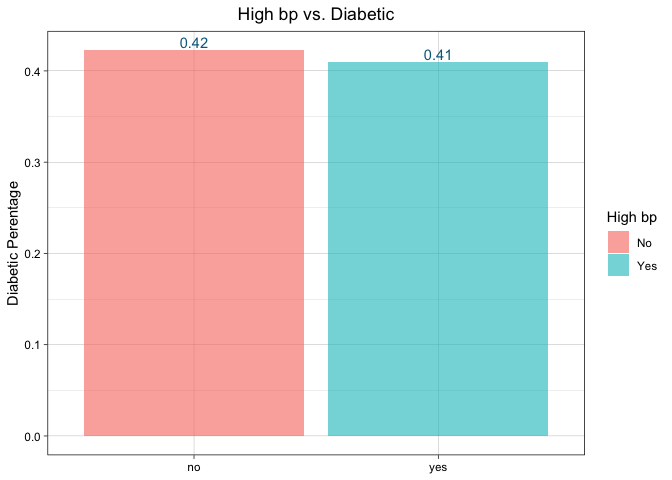<!-- -->


## Smoking vs. diabetes

### For diabetes_2019:
Relationship between smoking and diabetic

```r
diabetes_2019_tidy %>% 
  filter(diabetic_status != "NA") %>% 
  count(diabetic_status, smoking) %>% 
  pivot_wider(names_from = diabetic_status,
              names_prefix = "diabetic_",
              values_from = n) %>% 
  mutate(diabetic_per = diabetic_1/(diabetic_1+diabetic_0)) %>% 
  ggplot(aes(x=smoking, y=diabetic_per, fill = smoking, label=sprintf("%0.2f", round(diabetic_per, digits = 2))))+
  geom_col(alpha = 0.6)+
  scale_fill_discrete(labels=c("No", "Yes"))+
  geom_text(vjust = -0.3, color = "deepskyblue4")+
  theme_linedraw()+
  labs(title = "Smoking vs. Diabetic", 
       x = NULL,
       y = "Diabetic Perentage")+
  guides(fill = guide_legend(title = "Smoking"))+
  theme(plot.title = element_text(hjust = 0.5))
```

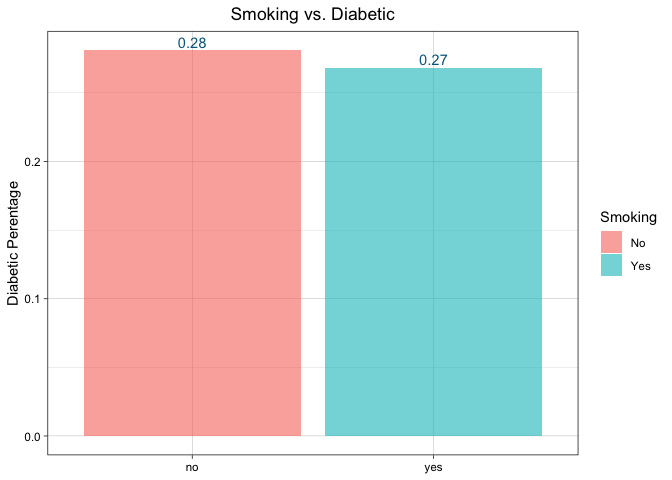<!-- -->
### For heart failture:
Relationship between smoking and diabetic

```r
heart_failture_tidy %>% 
  filter(diabetes != "NA") %>% 
  count(diabetes, smoking_status) %>% 
  pivot_wider(names_from = diabetes,
              names_prefix = "diabetic_",
              values_from = n) %>% 
  mutate(diabetic_per = diabetic_1/(diabetic_1+diabetic_0)) %>% 
  ggplot(aes(x=smoking_status, y=diabetic_per, fill = smoking_status, label=sprintf("%0.2f", round(diabetic_per, digits = 2))))+
  geom_col(alpha = 0.6)+
  scale_fill_discrete(labels=c("No", "Yes"))+
  geom_text(vjust = -0.3, color = "deepskyblue4")+
  theme_linedraw()+
  labs(title = "Smoking vs. Diabetic", 
       x = NULL,
       y = "Diabetic Perentage")+
  guides(fill = guide_legend(title = "Smoking"))+
  theme(plot.title = element_text(hjust = 0.5))
```

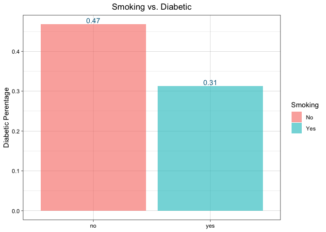<!-- -->


## Physically active vs. diabetes:

```r
diabetes_2019_tidy %>% 
  filter(physically_active != "NA") %>% 
  filter(diabetic_status != "NA") %>% 
  group_by(physically_active) %>% 
  summarize(diabetic = sum(diabetic_status)) %>% 
  ggplot(aes(x=physically_active, y=diabetic, fill = physically_active))+
  geom_col(alpha = 0.6)+
  scale_x_discrete(limits = c("none", "less than half an hr", "more than half an hr", "one hr or more"))+
  geom_text(aes(label=diabetic, vjust = -0.2), color = "deepskyblue4")+
  theme_linedraw()+
  labs(title = "Physically Active vs. Diabetic", 
       x = "Physically Active",
       y = "Diabetic")+
  theme(plot.title = element_text(hjust = 0.5))
```

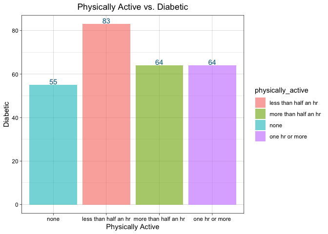<!-- -->

## Bmi and diabetes
### Density plot

```r
diabetes_2019_tidy %>% 
  filter(diabetic_status!="NA") %>% 
  mutate(diabetic_status=as_factor(diabetic_status)) %>% 
  ggplot(aes(x=bmi, fill=diabetic_status))+
  geom_density(alpha=0.6)+
  theme_linedraw()+
  scale_fill_discrete(labels=c("No", "Yes"))+
  labs(title = "Bmi vs. Diabetic", 
       x = "Bmi",
       y = NULL)+
  guides(fill = guide_legend(title = "Diabetes"))+
  theme(plot.title = element_text(hjust = 0.5))
```

```
## Warning: Removed 3 rows containing non-finite values (`stat_density()`).
```

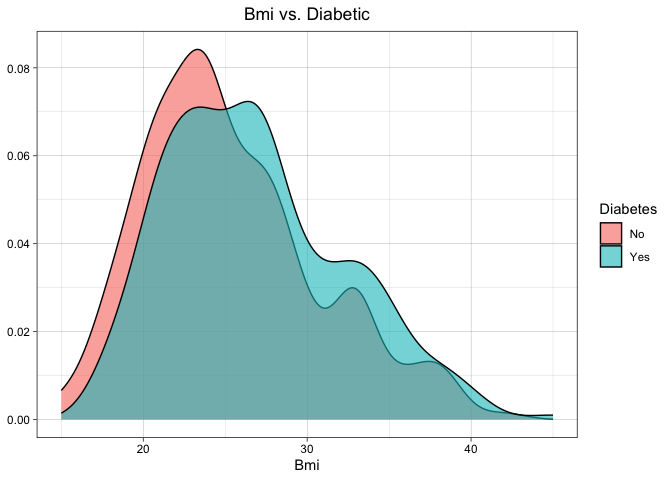<!-- -->

### Box plot

```r
diabetes_2019_tidy %>% 
  filter(diabetic != "NA") %>% 
  ggplot(aes(x=diabetic, y=bmi, fill = diabetic))+
  geom_boxplot(alpha = 0.6)+
  theme_linedraw()+
  scale_fill_discrete(labels=c("No", "Yes"))+
  labs(title = "Bmi vs. Diabetic", 
       x = NULL,
       y = NULL)+
  guides(fill = guide_legend(title = "Diabetes"))+
  theme(plot.title = element_text(hjust = 0.5))
```

```
## Warning: Removed 3 rows containing non-finite values (`stat_boxplot()`).
```

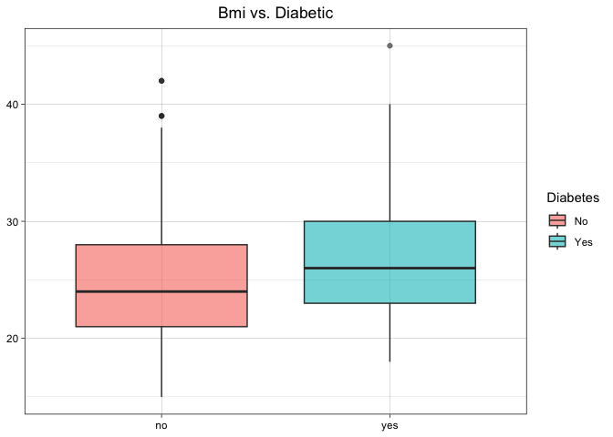<!-- -->

## Mapping of diabetes percentage by counties

```r
library(usmap)
```
## Data import:
All the data is directly downloaded from the CDC United States Diabetes Surveillance System. 

```r
here()
```

```
## [1] "/Users/manxiangling/Desktop/Group_project"
```

```r
map_data_2004 <- read_csv(here("Tony Tao", "Group Project Data", "DiabetesAtlas_CountyData2004.csv"), skip = 2, na = "No Data")
```

```
## Rows: 3148 Columns: 6
## ── Column specification ────────────────────────────────────────────────────────
## Delimiter: ","
## chr (3): County, State, CountyFIPS
## dbl (3): Percentage, Lower Limit, Upper Limit
## 
## ℹ Use `spec()` to retrieve the full column specification for this data.
## ℹ Specify the column types or set `show_col_types = FALSE` to quiet this message.
```

```r
map_data_2008 <- read_csv(here("Tony Tao", "Group Project Data", "DiabetesAtlas_CountyData2008.csv"), skip = 2, na = "No Data")
```

```
## Rows: 3148 Columns: 6
## ── Column specification ────────────────────────────────────────────────────────
## Delimiter: ","
## chr (3): County, State, CountyFIPS
## dbl (3): Percentage, Lower Limit, Upper Limit
## 
## ℹ Use `spec()` to retrieve the full column specification for this data.
## ℹ Specify the column types or set `show_col_types = FALSE` to quiet this message.
```

```r
map_data_2012 <- read_csv(here("Tony Tao", "Group Project Data", "DiabetesAtlas_CountyData2012.csv"), skip = 2, na = "No Data")
```

```
## Rows: 3148 Columns: 6
## ── Column specification ────────────────────────────────────────────────────────
## Delimiter: ","
## chr (3): County, State, CountyFIPS
## dbl (3): Percentage, Lower Limit, Upper Limit
## 
## ℹ Use `spec()` to retrieve the full column specification for this data.
## ℹ Specify the column types or set `show_col_types = FALSE` to quiet this message.
```

```r
map_data_2016 <- read_csv(here("Tony Tao", "Group Project Data", "DiabetesAtlas_CountyData2016.csv"), skip = 2, na = "No Data")
```

```
## Rows: 3148 Columns: 6
## ── Column specification ────────────────────────────────────────────────────────
## Delimiter: ","
## chr (3): County, State, CountyFIPS
## dbl (3): Percentage, Lower Limit, Upper Limit
## 
## ℹ Use `spec()` to retrieve the full column specification for this data.
## ℹ Specify the column types or set `show_col_types = FALSE` to quiet this message.
```

```r
map_data_2020 <- read_csv(here("Tony Tao", "Group Project Data", "DiabetesAtlas_CountyData2020.csv"), skip = 2, na = "No Data")
```

```
## Rows: 3148 Columns: 6
## ── Column specification ────────────────────────────────────────────────────────
## Delimiter: ","
## chr (3): County, State, CountyFIPS
## dbl (3): Percentage, Lower Limit, Upper Limit
## 
## ℹ Use `spec()` to retrieve the full column specification for this data.
## ℹ Specify the column types or set `show_col_types = FALSE` to quiet this message.
```
### For 2004:

```r
glimpse(map_data_2004)
```

```
## Rows: 3,148
## Columns: 6
## $ County        <chr> "Oglala Lakota County", "Wrangell City and Borough", "Sk…
## $ State         <chr> "South Dakota", "Alaska", "Alaska", "Alaska", "Alaska", …
## $ CountyFIPS    <chr> "46102", "02275", "02230", "02198", "02195", "02158", "0…
## $ Percentage    <dbl> NA, NA, NA, NA, NA, NA, NA, 4.3, 4.3, 4.5, 4.6, 4.7, 4.8…
## $ `Lower Limit` <dbl> NA, NA, NA, NA, NA, NA, NA, 3.5, 3.2, 3.4, 3.9, 3.9, 3.7…
## $ `Upper Limit` <dbl> NA, NA, NA, NA, NA, NA, NA, 5.3, 5.5, 5.7, 5.5, 5.5, 6.0…
```


```r
map_data_2004$CountyFIPS <- as.numeric(map_data_2004$CountyFIPS)
```


```r
map_data_focused_2004 <- map_data_2004 %>% 
  select(CountyFIPS, Percentage) %>% 
  rename(fips = CountyFIPS, values = Percentage)
```


```r
summary(map_data_focused_2004$values)
```

```
##    Min. 1st Qu.  Median    Mean 3rd Qu.    Max.    NA's 
##   4.300   6.100   6.300   6.487   6.800  11.200       7
```


```r
plot_usmap(data = map_data_focused_2004)+
  scale_fill_gradient2(low = "deepskyblue3", mid = "white", high = "red", name = "Diabetes Percentage", midpoint = 8)
```

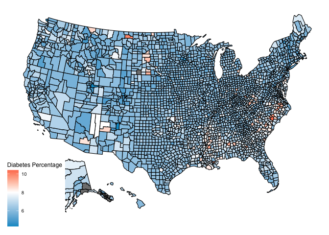<!-- -->

### For 2008:

```r
map_data_2008$CountyFIPS <- as.numeric(map_data_2008$CountyFIPS)
```


```r
map_data_focused_2008 <- map_data_2008 %>% 
  select(CountyFIPS, Percentage) %>% 
  rename(fips = CountyFIPS, values = Percentage)
```


```r
summary(map_data_focused_2008$values)
```

```
##    Min. 1st Qu.  Median    Mean 3rd Qu.    Max.    NA's 
##   3.900   6.700   7.500   7.842   8.800  15.000       7
```


```r
plot_usmap(data = map_data_focused_2008)+
  scale_fill_gradient2(low = "deepskyblue3", mid = "white", high = "red", name = "Diabetes Percentage", midpoint = 8)
```

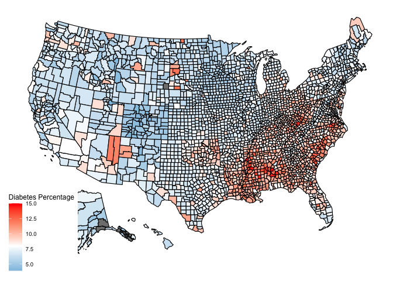<!-- -->

### For 2012:

```r
map_data_2012$CountyFIPS <- as.numeric(map_data_2012$CountyFIPS)
```


```r
map_data_focused_2012 <- map_data_2012 %>% 
  select(CountyFIPS, Percentage) %>% 
  rename(fips = CountyFIPS, values = Percentage)
```


```r
summary(map_data_focused_2012$values)
```

```
##    Min. 1st Qu.  Median    Mean 3rd Qu.    Max.    NA's 
##   4.600   7.400   8.300   8.592   9.600  18.200       5
```


```r
plot_usmap(data = map_data_focused_2012)+
  scale_fill_gradient2(low = "deepskyblue3", mid = "white", high = "red", name = "Diabetes Percentage", midpoint = 8)
```

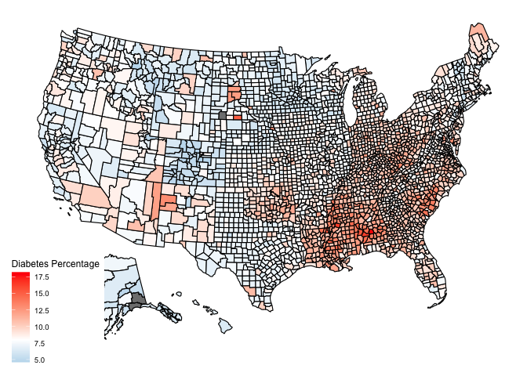<!-- -->

### For 2016:

```r
map_data_2016$CountyFIPS <- as.numeric(map_data_2016$CountyFIPS)
```


```r
map_data_focused_2016 <- map_data_2016 %>% 
  select(CountyFIPS, Percentage) %>% 
  rename(fips = CountyFIPS, values = Percentage)
```


```r
summary(map_data_focused_2016$values)
```

```
##    Min. 1st Qu.  Median    Mean 3rd Qu.    Max.    NA's 
##   3.800   7.300   8.200   8.474   9.400  17.700       6
```


```r
plot_usmap(data = map_data_focused_2016)+
  scale_fill_gradient2(low = "deepskyblue3", mid = "white", high = "red", name = "Diabetes Percentage", midpoint = 8)
```

<!-- -->

### For 2020:

```r
map_data_2020$CountyFIPS <- as.numeric(map_data_2020$CountyFIPS)
```


```r
map_data_focused_2020 <- map_data_2020 %>% 
  select(CountyFIPS, Percentage) %>% 
  rename(fips = CountyFIPS, values = Percentage)
```


```r
summary(map_data_focused_2020$values)
```

```
##    Min. 1st Qu.  Median    Mean 3rd Qu.    Max.    NA's 
##   4.100   7.300   8.300   8.623   9.600  16.400       7
```


```r
plot_usmap(data = map_data_focused_2020)+
  scale_fill_gradient2(low = "deepskyblue3", mid = "white", high = "red", name = "Diabetes Percentage", midpoint = 8)
```

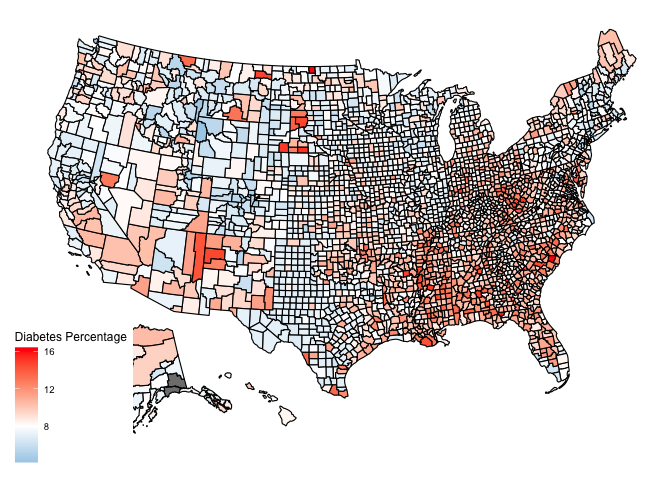<!-- -->
